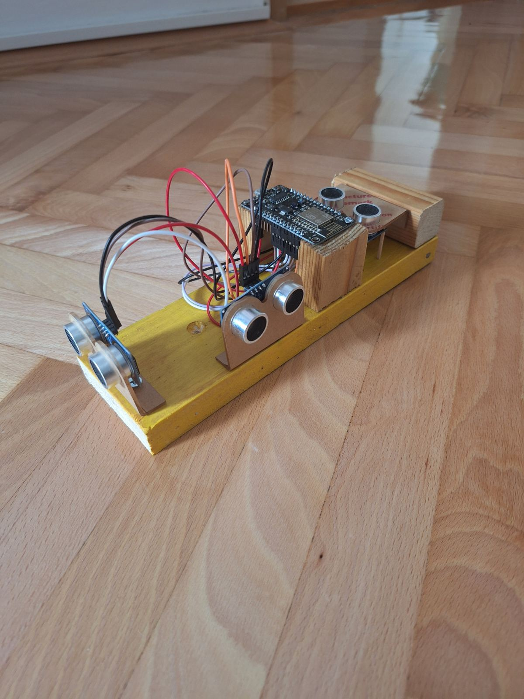
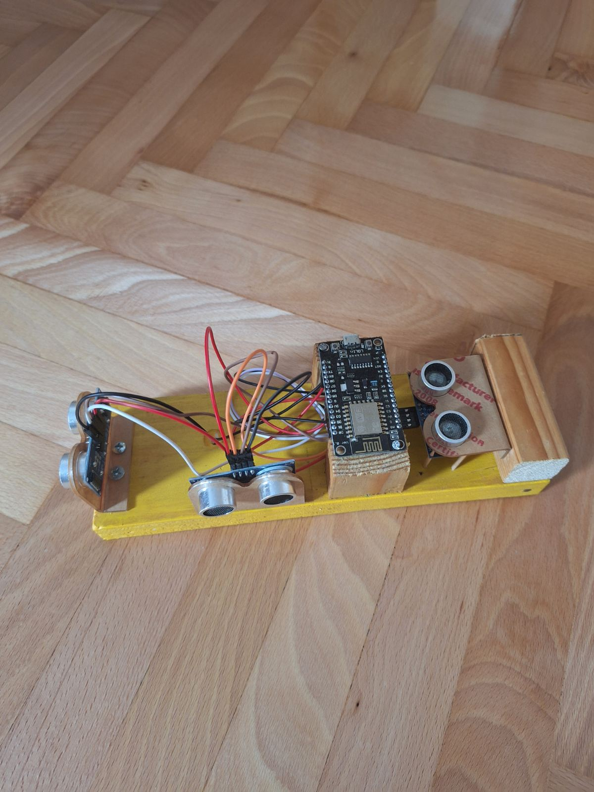
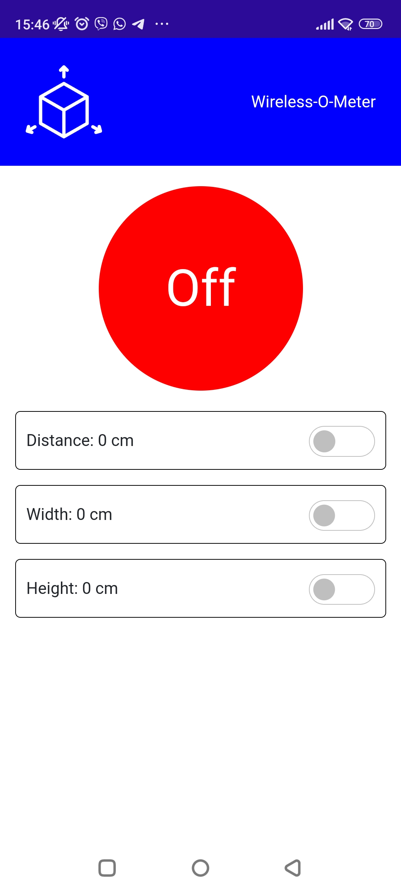
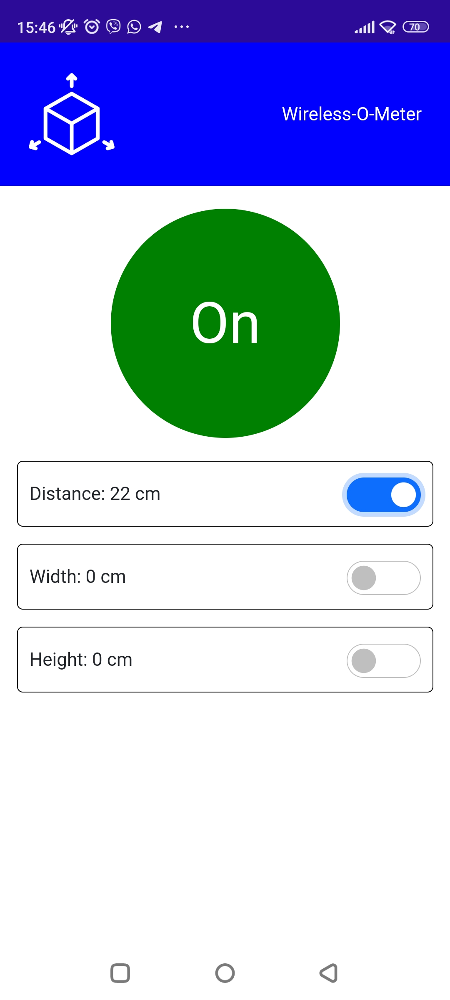
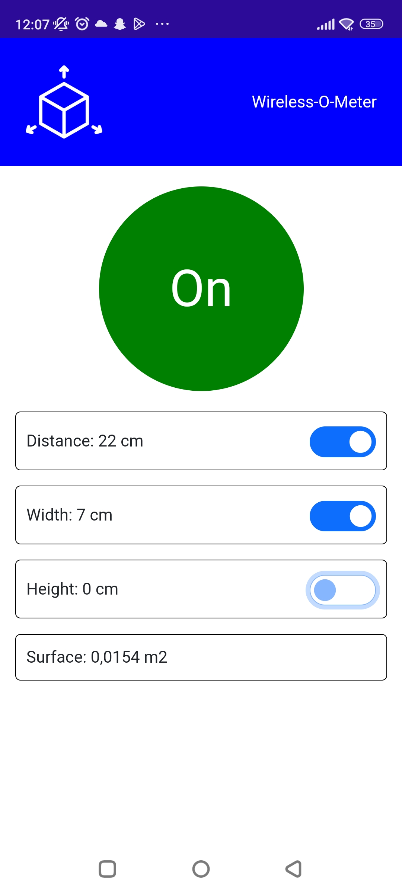
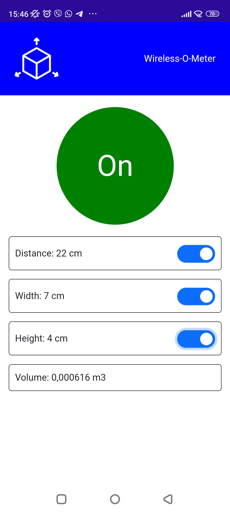

# IoT 3D Space Measurement Device

## Overview

This project is an simple IoT device that uses three ultrasonic sensors to measure distances in all directions in 3D space: width, height, and depth. The device is controlled by a .NET MAUI Blazor mobile application that receives information from Firebase realtime database, which allows users to manage the device and read measurements.
<div display:flex>
  
  
</div>

## Features

- **Three Ultrasonic Sensors**: Measure width, height, and distance.
- **.NET MAUI Blazor Mobile Application**: 
  - Four switches: 
    - Device On/Off
    - Three individual sensor On/Off switches
  - Display individual measurements for width, height, and distance
  - Calculate and display the surface area or volume of the measured space based on the number of active sensors

## Hardware Requirements

- Three Ultrasonic Sensors
- Microcontroller compatible with .NET MAUI Blazor 
- Power Supply

## Software Requirements

- .NET MAUI Blazor
- Firebase realtime database
- Development environment for .NET 
- Necessary libraries for interfacing with ultrasonic sensors

## Installation and Setup

### Hardware Setup

1. **Connect Ultrasonic Sensors**:
    - Connect each of the three ultrasonic sensors to the microcontroller.
    - Ensure sensors are positioned to measure width, height, and depth accurately.

2. **Power the Microcontroller**:
    - Connect the microcontroller to a power supply.

### Software Setup

1. **Clone the Repository**:
    ```sh
    git clone https://github.com/your-repo/iot-3d-measurement.git
    cd iot-3d-measurement
    ```

2. **Open the Project**:
    - Open the project in your preferred .NET development environment.

3. **Configure the Application**:
    - Ensure the GPIO pins in the code match the pins to which the sensors are connected.
    - Modify any necessary configurations in the appsettings.json or relevant configuration files.

4. **Deploy the Application**:
    - Deploy the .NET MAUI Blazor application to your mobile device.

## Usage

1. **Start the Device**:
    - Use the mobile application to turn the device on.

2. **Activate Sensors**:
    - Use the individual sensor switches in the application to turn each sensor on or off as needed.

3. **Read Measurements**:
    - The application will display real-time measurements from each active sensor.
    - You can also view the calculated surface area or volume based on the active sensors.
<div display:flex>
  
  
  
  
</div>


## Contact

For any inquiries or support, please contact cevraensar@gmail.com
